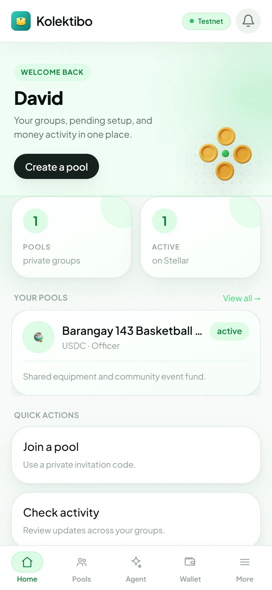
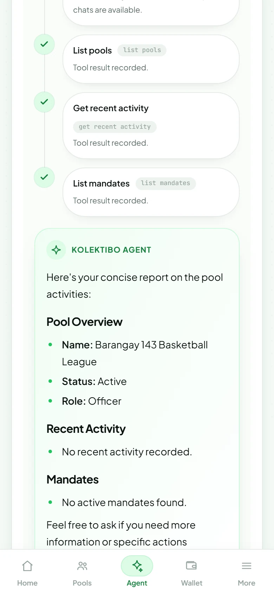
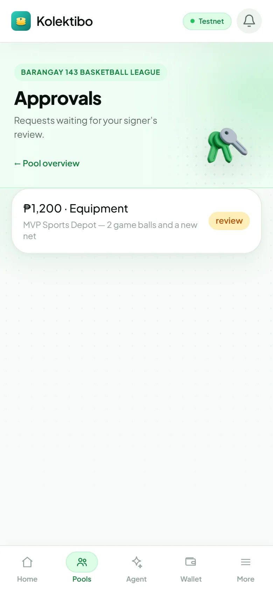
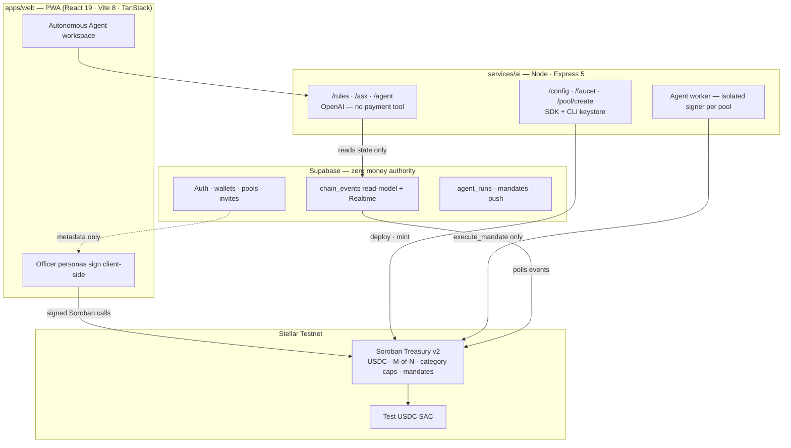

<div align="center">


<br/>

**AI-Governed Group Treasury on Stellar**

*Pooled money your group can trust — locked by a Soroban smart contract, not one treasurer.*

[](https://stellar.org)
[](./DEPLOYMENT.md)
[](https://github.com)
[](./docs/qa-report_2026-07-11_0254.md)
[](./contracts/treasury)

<br/>

[](https://stellar.org)
[](https://soroban.stellar.org)
[](https://www.circle.com/en/usdc)
[](./contracts/treasury)
[](./apps/web)
[](./apps/web)
[](./apps/web)
[](./apps/web)
[](./services/ai)
[](./services/ai)
[](./services/ai)
[](./supabase)
[](./apps/web)
[](./package.json)
[](./tests/e2e)
[](./apps/web)
[](./apps/web/src/locales)

<br/>

[**Try the demo**](#-try-it-in-60-seconds) · [**On-chain proof**](#-trust-you-can-verify) · [**Architecture**](#-architecture) · [**Team**](#-team) · [**Get started**](#-quick-start) · [**Docs**](./docs/00-INDEX_2026-07-11_0146.md)

</div>

---

<table>
<tr>
<td width="33%" valign="top">

### 🟢 One shared pool
Everyone chips in to one fund. Balances update **on-chain**, in pesos — nobody keeps the cash at home.

</td>
<td width="33%" valign="top">

### ✨ An AI treasurer
Ask *"how much do we have?"* or *"where did the money go?"* — answers grounded in **live chain state**.

</td>
<td width="33%" valign="top">

### 🔒 Locked by a contract
Funds move **only** when your rules and enough officers say so. No single person — **not even the AI** — can drain the fund.

</td>
</tr>
</table>

---

## Why Kolektibo

> **Kolektibo** (*Tagalog: pooled capital*) replaces the notebook and the single trusted treasurer with an **AI interface** backed by a **Soroban smart contract** that holds USDC and enforces M-of-N approvals + per-category spend caps on every release.

| What your group needs | What Kolektibo delivers |
|---|---|
| **Simple, from a phone** | A treasury any barangay committee, church group, or team _pondohan_ can run — no seed phrase, no wallet extension required |
| **Built for how Filipinos pool money** | Designed for barangay funds, church collections, co-ops, and reunion funds; your group thinks in **₱**, settles in **USDC** on Stellar |
| **Room to grow** | Soroban treasury + SAC USDC + autonomous delegated mandates — ready for GCash on-ramps and idle-fund yield |
| **Trust without blind faith** | Money authority lives **only** on-chain; Supabase handles identity and read-models with **zero fund authority** |
| **Real software, live today** | Full loop **running on testnet** — explorer links, 12/12 automated QA scenarios, 8/8 contract unit tests |

### Safety by design — the contract, not the AI

The AI can't play favorites, can't be bribed, and can't drain the fund — it has **no payment tool** and **no keys**. It can only ever call a contract that enforces the group's policy:

1. Officer requests a spend → contract checks **category cap** immediately.
2. Contract collects **2-of-3 officer signatures** (`require_auth` on every approval).
3. **Release** transfers real USDC — and only then. One officer alone is **reverted on-chain** (`NotEnoughApprovals`).

---

## Trust you can verify

Every movement of funds is on **Stellar Testnet** and publicly auditable on [stellar.expert](https://stellar.expert/explorer/testnet).

| Artifact | ID / hash |
|---|---|
| **Treasury (canonical demo)** — 2-of-3, seeded 20,000 USDC | [`CBR36Q2AEAUQWZ6CXESIYEGWPYCDUDHQP62EEYFHS5JELW4T3FGKINF2`](https://stellar.expert/explorer/testnet/contract/CBR36Q2AEAUQWZ6CXESIYEGWPYCDUDHQP62EEYFHS5JELW4T3FGKINF2) |
| **Treasury v2 Wasm** (autonomous mandates) | `ac4ec50f445fb38e6ff785b839351b76bd15225b9920342f52638aed3b672457` |
| Test USDC (Stellar Asset Contract) | [`CDTCIZLKSZNDFDSZRQUFIHQ5P5L2OOI5DDOMSY5NH6NQQTGSOE5LK7QR`](https://stellar.expert/explorer/testnet/contract/CDTCIZLKSZNDFDSZRQUFIHQ5P5L2OOI5DDOMSY5NH6NQQTGSOE5LK7QR) |
| **Proof: 2-of-3 USDC release** (1 approval blocked, then success) | [`127e4e3f…aa31278`](https://stellar.expert/explorer/testnet/tx/127e4e3f868798c3df9d6d8f4376d18e38d80dc9b470f961cb87420d1aa31278) |

**Protections enforced on-chain:**

| Scenario | What happens |
|---|---|
| One officer tries to release funds alone | ❌ Blocked — `NotEnoughApprovals` |
| Same officer approves twice | ❌ Blocked — `AlreadyApproved` |
| Spend exceeds category cap (₱6,000 vs ₱5,000 Equipment) | ❌ Blocked — `OverCategoryLimit` |
| Non-officer proposes a spend | ❌ Blocked — `NotOfficer` |
| 2-of-3 threshold met, then release | ✅ Real USDC `transfer` event |

Full deployment record: [`DEPLOYMENT.md`](./DEPLOYMENT.md) · Proof write-up: [`docs/06-deployment-and-onchain-proof`](./docs/06-deployment-and-onchain-proof_2026-07-11_0146.md)

---

## 📱 The product

<div align="center">

| Pool dashboard | AI treasurer | Spend approvals |
|:---:|:---:|:---:|
|  |  |  |

*No wallet extension. No seed phrase. Feels like a chat app — every action links to stellar.expert.*

</div>

### Two apps, one codebase

| | **Try it now** (`/demo/*`) | **Your pools** (`/app/*`) |
|---|---|---|
| **Best for** | First look — works instantly, no setup | Day-to-day use across devices |
| Identity | 3 in-browser officer personas | Your account + linked wallet |
| Pool | One live treasury on testnet | Many pools, invites, full roster |
| Status | ✅ Live and ready to explore | ✅ Multi-device product (Supabase) |

---

## Try it in 60 seconds

```bash
pnpm install
cp services/ai/.env.example services/ai/.env   # set OPENAI_API_KEY
pnpm --filter @kolektibo/ai sdk:configure
pnpm dev                                         # web :5173 · backend :8787
```

Open **http://localhost:5173/demo** and walk through the full experience:

| Step | What you do | What you see |
|:---:|---|---|
| **1** | **Create a pool** on Stellar testnet | A real treasury contract, 3 officers, seeded USDC |
| **2** | **Contribute** as a member | Funds land in the shared contract |
| **3** | **Request a spend** | Auto-approval shows **1/2** — Release stays locked |
| **4** | **Approve** as a second officer | Badge flips to **2/2** — Release unlocks |
| **5** | **Release** the payment | USDC moves; balance updates; tx link on stellar.expert |
| **6** | **Ask the AI** — *"where did the money go?"* | A plain-language answer grounded in on-chain history |
| **7** | Try an **over-limit** spend | Submit stays disabled — your rules hold |

Full walkthrough + troubleshooting: [`docs/09-how-to-run`](./docs/09-how-to-run_2026-07-11_0146.md)

---

## 🏗 Architecture



**Architecture law:** money authority lives **only** in Soroban contracts. Supabase holds identity, directory, metadata, and read-models. If the DB is wiped, **not one centavo is at risk**.

Deep dive: [`ARCHITECTURE.md`](./ARCHITECTURE.md) · Contract reference: [`docs/03-smart-contract`](./docs/03-smart-contract_2026-07-11_0146.md)

---

## 🤖 Autonomous Agent

Officers can approve a **delegated mandate** on-chain — fixed recipient, category, amount, schedule, expiry, execution count, and minimum-balance floor. An isolated per-pool agent signer may then execute **only** that mandate; Soroban rechecks every limit before transferring USDC.

- Model **never** receives agent keys · **no** direct transfer tool
- Any officer can **pause** immediately; resume/revoke uses threshold governance
- Full audit trail: runs, tool steps, tx hashes visible to pool members

Operations guide: [`docs/autonomous-agent`](./docs/autonomous-agent_2026-07-15.md)

---

## Built and tested

| Layer | Evidence |
|---|---|
| **Soroban contract** | 8/8 unit tests (`cargo test -p treasury`) — happy path, threshold gate, category cap, non-officer block |
| **Playwright E2E** | 12/12 scenarios PASS — full on-chain loop, over-limit guards, AI Q&A grounded in chain state ([QA report](./docs/qa-report_2026-07-11_0254.md)) |
| **Node smoke tests** | Create → fund → trustline → faucet → contribute → request → approve → execute |
| **Multi-device E2E** | Two users, two devices: link wallet → invite → deploy → cross-device approve → release; indexer captured all 4 event types |
| **Agent E2E** | `tests/e2e/agent.spec.ts` — mandate draft, governance, constrained execution |

```bash
cargo test --manifest-path contracts/treasury/Cargo.toml   # contract
pnpm --filter @kolektibo/ai test                           # agent memory
pnpm test:e2e                                              # Playwright (needs dev servers)
```

---

## 🗂 Monorepo layout

```
kolektibo/
├── contracts/treasury/     Soroban treasury v1+v2 (Rust) — policy, M-of-N, mandates
├── apps/web/               Capacitor-ready PWA + generated contract bindings
├── services/ai/            AI treasurer, SDK chain ops, event indexer, agent worker
├── supabase/migrations/    Identity, pools, chain_events, agent persistence (RLS everywhere)
├── scripts/                Testnet deploy, asset optimize, Supabase push setup
├── tests/e2e/              Playwright — demo, agent, push notification flows
└── docs/                   11 topic docs + QA + production roadmap + app map
```

---

## 🚀 Quick start

### Prerequisites

| Tool | Version |
|---|---|
| Node.js | ≥ 22.13 |
| pnpm | ≥ 11 |
| Rust + Stellar CLI | For contract build/deploy (`winget install Rustlang.Rustup Stellar.StellarCLI`) |
| OpenAI API key | For `/rules`, `/ask`, `/agent` |

### Run

```bash
git clone <repo-url> && cd kolektibo
pnpm install

cp services/ai/.env.example services/ai/.env
# Edit: OPENAI_API_KEY=sk-...

pnpm --filter @kolektibo/ai sdk:configure   # export Stellar CLI identities to server env
pnpm dev                                     # parallel: web :5173 + ai :8787
```

| Service | URL |
|---|---|
| Web (landing + demo) | http://localhost:5173 |
| Demo loop | http://localhost:5173/demo |
| Authenticated app | http://localhost:5173/app *(requires Supabase env)* |
| AI + chain-ops API | http://localhost:8787 |

### Optional: Supabase-backed product

```bash
# apps/web/.env.local — VITE_SUPABASE_URL, VITE_SUPABASE_ANON_KEY
# services/ai/.env — SUPABASE_SERVICE_ROLE_KEY, SP_ACCESS_TOKEN
# Flip multi_pool feature in apps/web when ready to exercise Phase 1
```

### Contract (advanced)

```bash
cargo test --manifest-path contracts/treasury/Cargo.toml
pnpm contract:build
pnpm contract:deploy    # ⚠️ deploys a fresh contract instance with new IDs
```

> **Windows:** `cargo` / `stellar` may not be on PATH in a fresh shell — run `source scripts/env.sh` first (Git Bash) or add Rust/Stellar CLI to PATH.

---

## 👥 Team

<div align="center">

<sub><b>Built at APAC Stellar Hackathon 2026</b></sub>

<br/><br/>


<br/>

<sub>Five builders · one thesis — <b>the contract holds the money, the AI does the labor.</b></sub>

</div>

| | Member | Role |
|:---:|---|---|
| 🟢 | **David Bato-bato** | Tech Lead & Blockchain Engineer |
| ✨ | **Jasmin Ivy Fedilo** | Product Designer & UI/UX |
| ⚙️ | **Earl Clyde Banez** | Backend Engineer |
| 🖥️ | **Elton James Donato** | Frontend Engineer |
| 🖥️ | **Jan Shello Cabilin** | Frontend Engineer |

---

## 📚 Documentation

| Doc | Contents |
|---|---|
| [**Index**](./docs/00-INDEX_2026-07-11_0146.md) | Full doc map + live contract IDs |
| [**Project overview**](./docs/01-project-overview_2026-07-11_0146.md) | Vision, problem, target users, product story |
| [**Architecture**](./docs/02-architecture_2026-07-11_0146.md) | Data flow, stack versions, security model |
| [**Smart contract**](./docs/03-smart-contract_2026-07-11_0146.md) | Every function, error code, test, guarantee |
| [**Backend & AI**](./docs/04-backend-and-ai_2026-07-11_0146.md) | All endpoints, OpenAI, chain-ops |
| [**Frontend**](./docs/05-frontend_2026-07-11_0146.md) | Screens, personas, ₱-vs-USDC model |
| [**Deployment proof**](./docs/06-deployment-and-onchain-proof_2026-07-11_0146.md) | Tx hashes, E2E verification |
| [**How to run & demo**](./docs/09-how-to-run_2026-07-11_0146.md) | Step-by-step walkthrough |
| [**Autonomous agent**](./docs/autonomous-agent_2026-07-15.md) | Mandates, key isolation, worker ops |
| [**App map**](./docs/app-map_2026-07-15.md) | Whole-app orientation for new contributors |
| [**Production roadmap**](./docs/production-roadmap_2026-07-11_0552.md) | From MVP to full product |

---

## 🗺 Roadmap snapshot

| Capability | Status |
|---|---|
| Soroban policy + M-of-N approvals | ✅ deployed, 8/8 tests |
| AI: NL → policy + grounded Q&A | ✅ OpenAI |
| Create-your-pool + USDC faucet + trustlines | ✅ |
| Autonomous Agent + on-chain mandates (v2) | ✅ Testnet |
| Multi-device auth, pools, feeds, push | ✅ Phase 1 (flag-gated) |
| GCash / SEP-24 on-off-ramp | ⏳ composability next hop |
| Idle-fund yield (Blend / Soroswap) | ⏳ composability next hop |
| Paluwagan (rotating ROSCA) | 📦 contract verified; descoped from demo — [decision record](./docs/decision-descope-paluwagan_2026-07-11_1345.md) |

---

## 🌐 Networks & conventions

- **Network:** Stellar **Testnet** only — Friendbot funding, test USDC SAC, no real funds
- **Display:** group thinks in **₱** (1 USDC ≈ ₱1 for demo)
- **Settlement:** USDC on-chain, 7 decimals — `raw = ₱ × 10_000_000`
- **Explorer:** https://stellar.expert/explorer/testnet

---

<div align="center">

**Kolektibo** — *pooled capital, guarded by code.*

Built with 💚 for Filipino communities · Powered by **Stellar · Soroban · USDC · Supabase**

<br/>

[](https://stellar.org)
[](https://soroban.stellar.org)
[](https://www.circle.com/en/usdc)
[](https://supabase.com)

</div>
