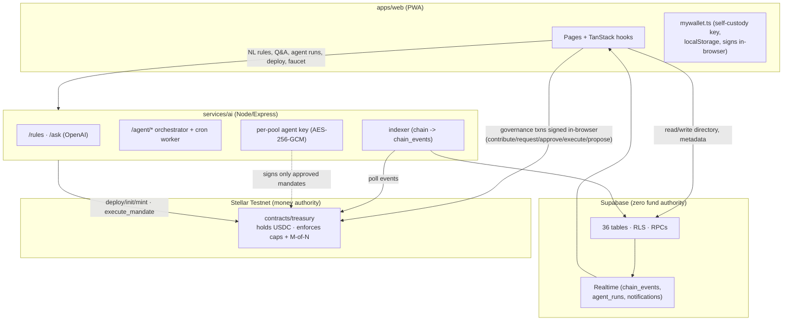
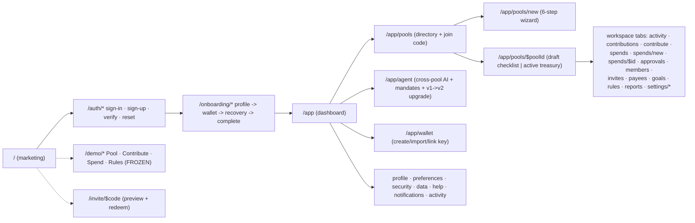

# Kolektibo — Whole‑App Orientation Map

_2026‑07‑15 · a new‑contributor orientation to what the app is and how every page connects._
_Companion to [`ARCHITECTURE.md`](../ARCHITECTURE.md); this doc is the "read me first" mental model._

---

## 1. What Kolektibo is

An **AI‑governed group treasury** for Filipino pooled‑money culture — barangay projects, church
collections, co‑op capital, class/reunion funds, team _pondohan_, _paluwagan_. It replaces the
"one trusted treasurer with a notebook" pattern with two things working together:

- A **Soroban smart contract on Stellar** physically holds the pooled USDC and only releases it
  when the group's rules are met (per‑spend category cap + M‑of‑N officer approvals). **This is the
  trust core.**
- An **AI treasurer** that does a treasurer's _labor_ — answering "how much do we have / where did
  it go," drafting spending mandates — but holds **no keys and has no payment tool**.

**The one law, restated in every layer:** money authority lives **only** on‑chain. Supabase stores
identity, directory, metadata, receipts, and read‑models, all keyed by on‑chain identifiers
(`contract_id`, `tx_hash`, `spend_id`). Wipe the database and **no funds are at risk**.
(See `supabase/migrations/0001_init.sql:1-14`, `apps/web/src/lib/supabase.ts:11-17`.)

Everything runs on **Stellar Testnet**. The group thinks in **₱**; settlement is **USDC as a
Stellar Asset Contract (SAC)** with 7 decimals (`raw = ₱ × 1e7`).

---

## 2. It's two apps in one shell

`apps/web/src/components/AppShell.tsx` swaps the entire chrome by URL. The codebase is **two
parallel stacks that never touch**:

| | **Demo** (`/demo/*`) | **Production** (`/app/*`) |
|---|---|---|
| Identity | 3 in‑browser localStorage "officer personas" | Supabase account + your own linked wallet |
| Pool | one seeded contract id in `localStorage` | many pools from Supabase `pool_members` |
| Chain client | `lib/livepool.ts` (persona‑coupled, **frozen**) | `lib/poolClient.ts` (parameterized) |
| Activity | local `lib/txlog.ts` fallback | indexed `chain_events` + Realtime |
| Gated by | nothing | Supabase auth + feature flags |

The **demo is the "it works today" proof and is under a deliberate freeze** (see `CLAUDE.md`).
New work lives in the production stack and must be additive.

Other shells: a **public marketing site** (`/`, `/how-it-works`, `/features`, `/pricing`,
`/about`, `/help`, `/status`, `/legal/*`), **auth** (`/auth/*`), a focused **invite** shell
(`/invite/$code`), and **onboarding** (`/onboarding/*`). Many routes have `/legacy` aliases for
old bookmarks.

---

## 3. Three codebases (pnpm monorepo)

| Package | Role |
|---|---|
| `contracts/` | Rust/Soroban. **`treasury`** (the M‑of‑N fund each pool deploys) is live; **`paluwagan`** (rotating‑savings / ROSCA) is built + testnet‑verified but **dormant — not wired into the app**. |
| `apps/web/` | The PWA — Vite + React 19 + **TanStack Router** (code‑based) + TanStack Query + Tailwind v4. All pages live here. |
| `services/ai/` | Node/Express backend — AI treasurer, chain‑ops (deploy/faucet), encrypted per‑pool agent signer, event indexer. |

### Architecture at a glance

---

## 4. The money core — `contracts/treasury/src/lib.rs`

One deployed instance = one pool. State: token (USDC SAC), `officers: Vec<Address>`,
approval `threshold: u32`, per‑category **per‑spend** caps, per‑member contributions, spend
requests, and (v2) mandates + an immutable agent address.

**Roles:** officers are the **only** spend authority (M‑of‑N); members can only contribute;
there is **no on‑chain "owner"**; `execute`/`finalize` are deliberately **permissionless** (gated
purely by approval count); the v2 **agent** can call only `execute_mandate`.

**Human spend flow:** `contribute` → `request_spend` (officer; rejects over‑cap on the spot;
auto‑approves as #1) → `approve` (more officers) → `execute` (anyone; reverts unless
`approvals ≥ threshold`, then transfers).

**v1 vs v2 is a deploy‑time choice, not an in‑place upgrade** — there is no WASM upgrade
entrypoint. `initialize` → v1; `initialize_v2` → v2 (adds agent + mandate machinery).
"Migrating" a pool means deploying a **fresh** v2 contract and draining into it.

**Mandates (v2)** are pre‑authorized recurring/scheduled payments. A mandate pins an immutable
recipient, category, amount, schedule (`not_before`, `interval_seconds`, `expires_at`,
`max_executions`), a `min_balance` floor, and a `condition_hash` (audit commitment only —
conditions can delay but never expand the allowance). Officers `propose_mandate` →
`approve_mandate_proposal` → `finalize_mandate_proposal` (threshold). **Any single officer can
`pause_mandate` immediately; resuming/revoking/expanding always needs a fresh threshold vote.**
`execute_mandate` is callable **only by the pool's agent** and re‑checks every limit before
transferring.

> **Display‑only vs enforced:** the UI label "monthly limit" is on‑chain a strict **per‑spend
> cap** (`limit`). Dues / contribution schedules are **off‑chain** coordination (reminders,
> tracking) — the contract never performs an automatic debit. Rolling monthly caps and approval
> tiers are directory policy a future contract v2 would enforce.

---

## 5. The backend — `services/ai`

Node/Express, **OpenAI `gpt-4o-mini`** by default. Three jobs:

1. **Legacy LLM helpers** (no auth): `POST /rules` (plain English → policy JSON) and `POST /ask`
   (grounded Q&A). Used by the demo and the wizard's "AI prefill."
2. **Agentic orchestrator** (`/agent/*`, Supabase‑bearer auth): an **agent run** loads all your
   pools/activity from Supabase into memory, then drives an OpenAI tool‑calling loop (5 tools;
   only `draft_mandate` mutates) for up to 6 rounds, writing `agent_run_steps` as it goes. The UI
   **never polls** — it reads runs from Supabase and streams steps via Postgres Realtime.
3. **Autonomous executor**: a cron worker (`/agent/worker/tick`, or an in‑process poller) that
   atomically claims a due mandate, re‑verifies it **on‑chain**, checks conditions (goal met,
   balance floor), then signs `execute_mandate` with the pool's isolated **AES‑256‑GCM‑encrypted**
   agent key. Gated by `AGENT_WORKER_ENABLED` + `AGENT_AUTONOMY_ENABLED`.

Plus the **indexer** (`indexer.ts`) that mirrors contract events into `chain_events`, and
**chain‑ops** (deploy/init/mint) that sign with server‑held deployer/issuer keys (or the local
Stellar CLI keystore). **Chain truth is never trusted to the DB:** every mandate status transition
is verified by reading the contract back and matching it field‑for‑field, including
`condition_hash`.

Key files: `services/ai/src/index.ts`, `agent.ts`, `chain.ts`, `agentCrypto.ts`, `indexer.ts`.

---

## 6. The data model — 36 Supabase tables (all zero‑authority)

Grouped by job (`apps/web/src/db/types.gen.ts`, `supabase/migrations/*`):

- **Identity:** `profiles` (sole `is_email_verified` authority), `user_settings`, `user_wallets`
  (`verified_at` is service‑role‑only), `push_subscriptions`; service‑role `auth_email_codes`,
  `wallet_link_challenges`.
- **Pools & membership:** `pools` (directory row; `contract_id` nullable so drafts exist
  pre‑deploy), `pool_members` (`role`, per‑pool `stellar_address`), `pool_signers`, `pool_invites`,
  `invite_redemptions`, `payees`.
- **Normalized policy (wizard):** `pool_contribution_policies`, `pool_categories`,
  `pool_approval_tiers`, `pool_goals`, `pool_attachments` (private `receipts` bucket).
- **Chain read‑model:** `chain_events` + `indexer_cursor` (service‑role writes only),
  `spend_meta` / `contribution_meta` (notes/receipts on on‑chain records).
- **Autonomous agent:** `agent_identities` (encrypted per‑pool key), `agent_mandates`,
  `agent_runs` / `agent_run_steps`, `agent_executions` (claim ledger), `pool_contracts`,
  `pool_agent_upgrades`.
- **Ops:** `notifications`, `push_deliveries`, `ai_usage`, `audit_log`, `feature_flags`.

Every table is RLS‑guarded. Cross‑table checks use `SECURITY DEFINER` helpers
(`is_pool_member`, `is_pool_officer`, `shares_pool`); privileged writes go through RPCs
(`create_pool_draft`, `set_my_pool_address`, `activate_pool`, `preview_pool`, `redeem_invite`,
`replace_pool_governance_policy`, `delete_my_account`).

---

## 7. The wallet model (the one genuinely tricky part)

**Three separate localStorage keypairs**, kept under distinct keys so they never interact, plus a
Supabase directory of _linked_ addresses:

| File | localStorage key | Purpose |
|---|---|---|
| `lib/identity.ts` | `kolektibo.secret` | old **demo** single key |
| `lib/wallet.ts` | `kolektibo.personas.v1` | **demo's** three officer personas |
| `lib/mywallet.ts` | `kolektibo.mywallet.v1` | **production self‑custody wallet** (secret never leaves device) |

**Link flow** (Wallet page → `hooks/useWallet.ts`): create/fund/trustline → request backend nonce
→ sign a version‑prefixed, address‑bound challenge locally → backend verifies and sets
`user_wallets.verified_at` (service‑role‑only column). Supabase stores only your **public address
+ a backend‑verified proof** — never a private key. You then bind one verified address as your
pool signer via `set_my_pool_address`. Officer addresses **freeze at deploy** (the contract has no
`manage_officer`).

---

## 8. End‑to‑end lifecycle (how pages + DB + backend + contract connect)

1. **Sign up → verify → onboard** — `/auth/*` → `/onboarding/profile|wallet|recovery|complete`.
   Email verification is **not** Supabase‑native; the backend checks a 6‑digit code and sets
   `profiles.is_email_verified`.
2. **Create a pool** — 6‑step **wizard** (`/app/pools/new`). "AI prefill" → `POST /rules`.
   Submit → `create_pool_draft` RPC. **Supabase draft only; no contract, no money.**
3. **Draft → deploy** — pool page (`/app/pools/$poolId`, draft face). Officers link wallets; the
   creator picks the threshold and deploys: web → backend `chain.ts` → `createCustomContract` +
   `initialize`/`initialize_v2` → atomic `activate_pool`.
4. **Contribute** — `…/contribute`. Your **own** browser wallet signs `contribute`; tx hash
   mirrored into `contribution_meta`.
5. **Request → approve → release** — officer signs `request_spend` (simulates first; auto‑approve
   #1) → officers `approve` → permissionless `execute`. **All governance txns signed in‑browser;**
   the backend only reconciles.
6. **Index** — `indexer.ts` mirrors events into `chain_events`; RLS + Realtime push them to the
   Activity feed, Reports, and the Agent's context.
7. **Ask the AI / mandates** — `/app/agent`. `POST /agent/runs` runs the tool loop; steps stream
   via Realtime. `draft_mandate` moves no money — officers `propose → approve → finalize`
   on‑chain (each verified against the contract), after which the encrypted per‑pool agent key may
   fire `execute_mandate` on schedule.

### Route / shell map

---

## 9. How the product "turns on" — feature flags

Three flags in `feature_flags` gate everything (`lib/authGuard.ts` → `router.tsx:62-64`):

- **`production_shell`** → all of `/app/*`
- **`multi_pool`** → all `/app/pools/*`
- **`pool_wizard_v1`** → the create wizard `/app/pools/new`

All seeded **off**, then flipped **on for testnet** in migration
`20260715104500_activate_testnet_product_flags.sql`. When Supabase env is absent, every flag reads
`false` and the whole production surface disappears — leaving only the demo. That's the
"additive, no‑op when its env is absent" design mandated by `CLAUDE.md`.

---

## 10. Where to look

| I want to understand… | Start here |
|---|---|
| Routes / shells | `apps/web/src/router.tsx`, `components/AppShell.tsx` |
| The money contract | `contracts/treasury/src/lib.rs` |
| Browser → chain (read/write) | `lib/poolClient.ts` (prod), `lib/contract.ts`, `lib/stellar.ts`, `lib/livepool.ts` (demo) |
| Self‑custody wallet | `lib/mywallet.ts`, `hooks/useWallet.ts` |
| Backend + AI + worker | `services/ai/src/index.ts`, `agent.ts`, `chain.ts`, `agentCrypto.ts`, `indexer.ts` |
| Web ↔ agent API | `apps/web/src/lib/agentApi.ts`, `hooks/useAgent.ts`, `routes/Agent.tsx` |
| Data model | `supabase/migrations/*.sql`, `apps/web/src/db/types.gen.ts` |
| The pool workspace pages | `apps/web/src/routes/PoolWorkspace.tsx`, `PoolDetail.tsx` |
| Deeper reference | [`ARCHITECTURE.md`](../ARCHITECTURE.md), [`docs/00-INDEX`](./00-INDEX_2026-07-11_0146.md) |
